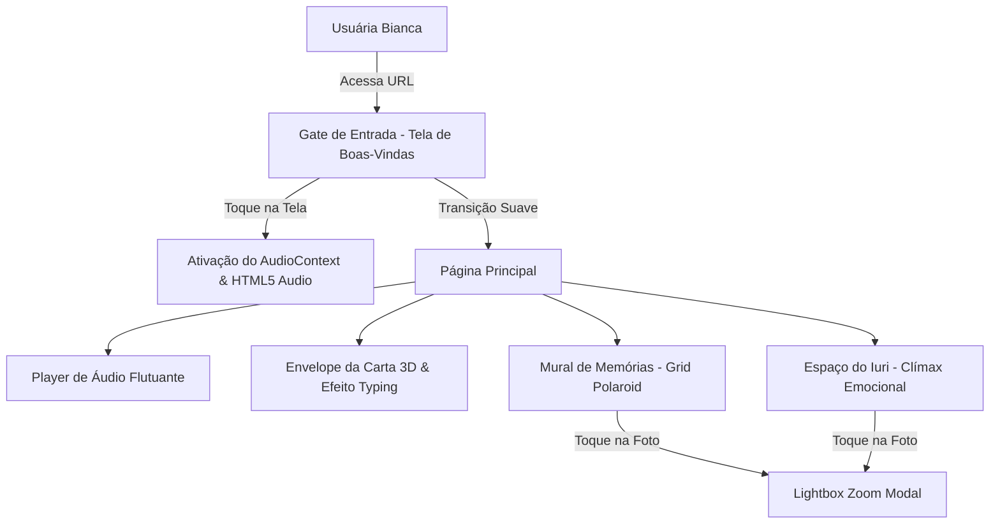
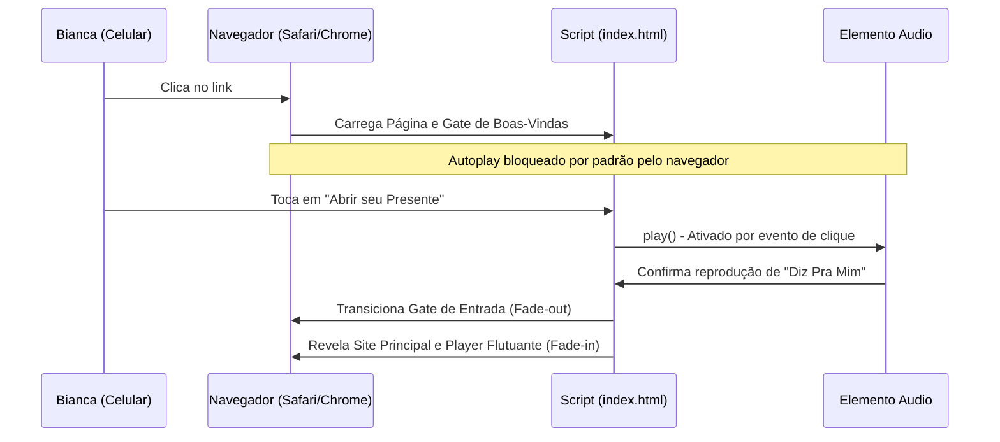

# Arquitetura Atual — Site Bianca Rayssa 21 Anos

## Status
**Ativo** — Arquitetura de MVP definida e validada.

---

## 1. Visão Geral da Solução

O site comemorativo de aniversário da Bianca é desenhado como uma **Single Page Application (SPA) estática**, altamente performática e projetada sob a filosofia de desenvolvimento pragmático (anti-overengineering). 

A aplicação foca 100% em dispositivos móveis, sendo servida diretamente por uma CDN global através da Vercel. Toda a inteligência da página (transições, controle de áudio, troca de abas e animações) reside no lado do cliente (Client-Side) utilizando recursos nativos modernos do HTML5, CSS3 e JavaScript Vanilla.



---

## 2. Stack Tecnológica

| Camada | Tecnologia | Justificativa |
| :--- | :--- | :--- |
| **Frontend Core** | HTML5 / CSS3 Moderno / ES6+ JavaScript | Estabilidade absoluta, facilidade de depuração móvel rápida e zero custos de build/compilação. |
| **Estilização** | Tailwind CSS (v3 via CDN) | Desenvolvimento ágil e responsivo de componentes diretamente nas classes do HTML, acelerando o tempo de entrega. |
| **Tipografia** | Google Fonts (Cormorant Garamond, Inter, Caveat) | Fontes carregadas dinamicamente para misturar sofisticação clássica, legibilidade de interface e escrita manuscrita. |
| **Hospedagem & CDN** | Vercel Static Hosting | Deploy em segundos diretamente da raiz do repositório, entrega ultra-rápida global por CDN e HTTPS nativo gratuito. |
| **Player de Áudio** | HTML5 Audio Element | API nativa simples para reprodução local de faixas de música, sem dependência de players pesados de terceiros (Spotify/YouTube). |

---

## 3. Estrutura de Pastas e Componentes

A estrutura de pastas foi otimizada para ser flat, simples de ler e imediatamente compatível com a hospedagem estática da Vercel.

```text
/ (raiz do repositório)
├── audio/            # Contém os arquivos de música locais (.mp3) otimizados
├── fotos/            # Fotos organizadas por subpastas categorizadas
│   ├── comigo-ivan/  # Fotos de casal
│   ├── iuri/         # Fotos do filho
│   ├── sozinha/      # Retratos da Bianca
│   └── zuadas/       # Fotos divertidas
├── index.html        # Arquivo unificado do frontend (HTML, estilos do Tailwind, scripts)
└── .vercelignore     # Ignora metadados de desenvolvimento (como maestro-ai/) no deploy
```

### Componentes de Interface (JavaScript / DOM)

*   **Gate de Áudio (`#gate-screen`):** Cortina inicial fixa que restringe o conteúdo visual do site e captura o primeiro toque físico do usuário. Isso é necessário para desbloquear a política de autoplay de áudio (`AudioContext`) de navegadores modernos de smartphones (iOS/Safari e Android/Chrome).
*   **Player Flutuante (`#music-player-dock`):** Dock fixo no rodapé que encapsula o objeto `Audio` do JS. Exibe o nome da faixa, o artista, o disco de vinil giratório (quando tocando) e provê ações de Play/Pause e Avançar Faixa.
*   **Envelope 3D (`#envelope-wrapper`):** Estrutura tridimensional em CSS com efeitos de dobra de papel e elevação que simula a abertura física de uma correspondência e dispara o efeito de escrita por caractere do texto.
*   **Grid Polaroid (`#photos-grid`):** Renderizador dinâmico de cards Polaroid que aplica rotações leves de CSS e lazy loading nativo nas fotos da galeria.
*   **Lightbox Modal (`#lightbox`):** Exibição em tamanho expandido das Polaroids com desativação temporária do scroll da página de fundo (`overflow: hidden`).

---

## 4. Fluxo de Dados e Controle de Áudio

### A. Fluxo de Inicialização e Desbloqueio de Áudio
1. A página carrega exibindo o `#gate-screen` com corações flutuantes gerados dinamicamente em JS.
2. A usuária toca em **"Abrir seu Presente"**.
3. O JavaScript inicializa a instância do `Audio` e chama o método `.play()`, garantindo que o contexto de áudio seja considerado ativo sob a permissão de interação humana do navegador.
4. O `#gate-screen` recebe classes de transição (`opacity-0 -translate-y-full`).
5. Decorridos 800ms, o Gate é ocultado (`display: none`) e a página principal `#main-content` é ativada suavemente. O player flutuante é revelado no rodapé com animação de subida.



### B. Fluxo do Ciclo de Vida da Playlist
1. O player carrega por padrão a faixa `0` (Jean Tassy).
2. Se a música chegar ao fim, o evento `ended` do elemento de áudio chama a função `nextTrack()`.
3. `nextTrack()` calcula o próximo índice de forma cíclica (`currentTrackIdx = (currentTrackIdx + 1) % playlist.length`), carrega o novo arquivo de áudio e inicia o `.play()`.
4. Os botões de avançar no player flutuante utilizam o mesmo fluxo de controle.

---

## 5. Riscos Técnicos e Mitigações

*   **Risco 1: Latência e Buffer de Áudio em conexões 3G/4G móveis.**
    *   *Mitigação:* Os arquivos de áudio originais são pesados (de 9MB a 17MB). Eles serão comprimidos para 128kbps em formato MP3 (gerando arquivos de ~3MB a 5MB cada) antes do deploy final. O player carrega as faixas de forma sob demanda, evitando baixar as três músicas simultaneamente no carregamento inicial.
*   **Risco 2: Carregamento lento das imagens Polaroid.**
    *   *Mitigação:* As fotos recebem o atributo `loading="lazy"` para carregar apenas quando estiverem próximas ao campo de visualização do scroll. As imagens de abas inativas não são carregadas até que a respectiva aba seja clicada pela Bianca.
*   **Risco 3: Caminhos de arquivos quebrados devido a acentuação e espaços.**
    *   *Mitigação:* Todos os assets de música e fotos na estrutura final de deploy serão renomeados no passo 1 do plano de implementação técnica para padrões alfanuméricos simples sem acentos, sem espaços e em letras minúsculas (ex: `liniker-veludo-marrom.mp3` e `fotos/comigo-ivan/casal-1.jpg`).
*   **Risco 4: Quebras de layout em celulares compactos (ex: iPhone SE com 320px).**
    *   *Mitigação:* Uso extensivo do Flexbox e CSS Grid do Tailwind com margens proporcionais (`padding: 1.5rem`) e adaptação automática das abas de fotos para rolagem horizontal suave (`overflow-x-auto no-scrollbar`), evitando cortes de tela.